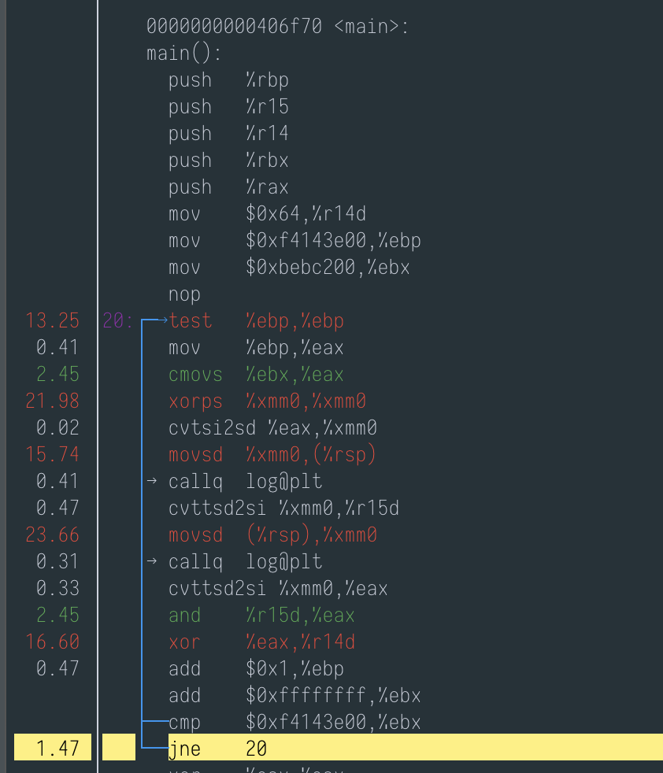
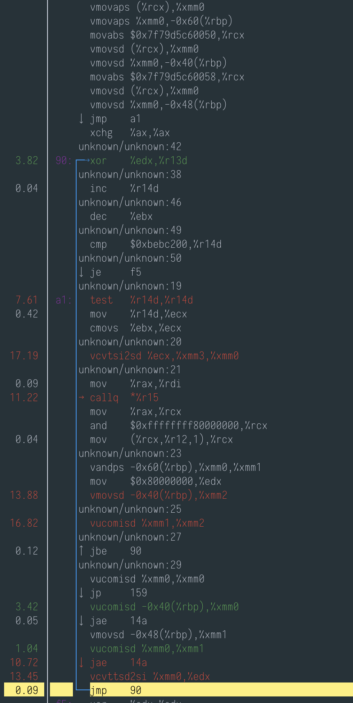
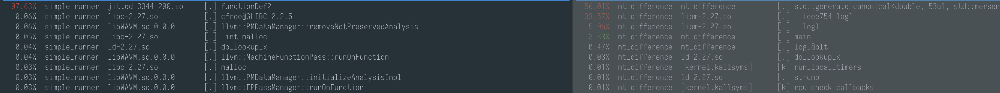

# Perf shows that the loops are doing the same

## Log function

Experiment code [here](../../func/demo/log_difference.cpp).

### Perf stat

#### Native

```
 Performance counter stats for 'speed_difference':

      14530.607857      task-clock (msec)         #    1.000 CPUs utilized
                 7      context-switches          #    0.000 K/sec
                 0      cpu-migrations            #    0.000 K/sec
               589      page-faults               #    0.041 K/sec
    46,636,539,230      cycles                    #    3.210 GHz
   114,771,451,699      instructions              #    2.46  insn per cycle
    13,208,253,517      branches                  #  908.995 M/sec
           196,535      branch-misses             #    0.00% of all branches

      14.531197506 seconds time elapsed
```

#### Wasm

```
 Performance counter stats for 'simple_runner demo speed_difference':

       4852.352536      task-clock (msec)         #    1.000 CPUs utilized
                 3      context-switches          #    0.001 K/sec
                 0      cpu-migrations            #    0.000 K/sec
             5,611      page-faults               #    0.001 M/sec
    14,531,719,357      cycles                    #    2.995 GHz
    35,368,260,394      instructions              #    2.43  insn per cycle
     4,120,953,595      branches                  #  849.269 M/sec
         5,078,676      branch-misses             #    0.12% of all branches

       4.852843140 seconds time elapsed
```

### Perf report

Symbol table:
```
functionDef35       log
functionDef2        __original_main
```

The global time spent in each section is very similar:


The loop bodies (pictures below) look quite similar -- unless the unknown/unknown:XX are something to worry about. The Wasm code 
fiddles a lot with the MM registers before the loop. Manually compiling the native code with `clang++ -O3 -mavx2 -S` for comparison lead
to the same code as shown below.





I think this is not a good experiment for general-purpose speed comparison between Wasm and Native because it seems that
here the only difference is that MUSL's log is faster than GLibC's log. When looking at the `log` function ran in Wasm,
it is a lot smaller than the GLibC one, which is the only explanation I have here for the speed difference.

This experiment is however useful for understanding our second experiment because there is a log function taking 25% of
the run time of the native Mersenne Twister engine experiment but there is no sign of `log` seems absent from the Wasm
which however leads to the same result. I can only think the log was somehow optimised away?

## Mersenne Twister Engine

Experiment code [here](../../func/demo/mt_difference.cpp).

### Perf stats

#### Native


```
       9170.419967      task-clock (msec)         #    1.000 CPUs utilized
                 5      context-switches          #    0.001 K/sec
                 0      cpu-migrations            #    0.000 K/sec
               588      page-faults               #    0.064 K/sec
    27,822,779,162      cycles                    #    3.034 GHz
    17,508,333,503      instructions              #    0.63  insn per cycle
     2,560,064,376      branches                  #  279.165 M/sec
         1,122,999      branch-misses             #    0.04% of all branches

       9.171005174 seconds time elapsed

```

#### Wasm

```


       1317.060034      task-clock (msec)         #    1.000 CPUs utilized
                 1      context-switches          #    0.001 K/sec
                 0      cpu-migrations            #    0.000 K/sec
             5,610      page-faults               #    0.004 M/sec
     2,992,325,962      cycles                    #    2.272 GHz
     6,657,716,630      instructions              #    2.22  insn per cycle
       218,836,121      branches                  #  166.155 M/sec
         5,013,145      branch-misses             #    2.29% of all branches

       1.317535341 seconds time elapsed
```


###  Perf Report

On the left, Wasm on the right, native. The symbol table is as follows. The
fact we only have the `main` function in Wasm seem to indicate there is some
inlining going on.
```
functionDef2        __original_main
```



And indeed we can compare the loop bodies in the main function we the native simply
calls the MT engine. And the Wasm code seem to be that same code but inlined (omitted
because it was too long).

The Native main loop uses `callq`, I'm not sure about perf's measures about the cost
of instructions (`callq` < `mov` < `add`), and it seems clear that it doesn't include
the time spent in `callq` because perf inverts the call graph.
